# LangGraph Recruiter Agent

A portfolio demo showing how to wrap an LLM in a small, explicit graph of
deterministic steps using [LangGraph](https://github.com/langchain-ai/langgraph).
Given a free-text role brief, the pipeline parses it into structured filters,
pulls candidates from a MySQL table of parsed LinkedIn profiles, ranks them
with an LLM, and synthesizes a cited shortlist for a hiring manager.


## Why this is interesting
- **LangGraph is the plumbing, not the magic.** Each node has a narrow job so
  the system is testable and easy to reason about.
- **LLM + SQL together.** Structured filters from the LLM are passed into
  parameterized SQL, so ranking only runs over rows that already pass
  hard constraints.
- **Graceful degradation.** Every node has a deterministic fallback: no
  `OPENAI_API_KEY`, no JSON output, no DB match — the graph still returns
  something meaningful and surfaces the reason in the UI.
- **Shippable demo surface.** Streamlit front end with parsed filters,
  ranked candidate cards, and a shortlist summary that cites `profile_id`s.

## Architecture

```mermaid
flowchart LR
    userQuery["User query (Streamlit)"] --> parseQuery[parse_query]
    parseQuery -->|"structured filters"| retrieveCandidates[retrieve_candidates]
    retrieveCandidates -->|"top-K rows (MySQL)"| rankCandidates[rank_candidates]
    rankCandidates -->|"scored + rationales"| synthesizeShortlist[synthesize_shortlist]
    synthesizeShortlist --> uiResult["Shortlist + citations"]
```



| Node | Responsibility | LLM? | Fallback |
|------|----------------|------|----------|
| `parse_query` | Extract structured filters (skills, location, must-have, min experience) from free-text brief | Yes (JSON) | Treat full brief as a role keyword |
| `retrieve_candidates` | Parameterized SQL over `linkedin_api_profiles_parsed` with weighted lexical scoring | No | Auto-relax strict filters when zero rows return |
| `rank_candidates` | Per-candidate 0-10 score, match reasons, risks | Yes | Deterministic score from relevance + experience + skills |
| `synthesize_shortlist` | Cited hiring-manager-ready summary of top candidates | Yes | Template list with `profile_id` citations |

Implemented in [`src/langgraph_app.py`](src/langgraph_app.py), with types in
[`src/schemas.py`](src/schemas.py) and DB access in
[`src/retriever.py`](src/retriever.py).

## Data

The demo reads from a MySQL table, `linkedin_api_profiles_parsed`, with the
following relevant columns:

- `profile_id` (unique)
- `name`, `headline`, `location`, `source_table`
- `about_text`, `about_char_count`
- `skills_json`, `skills_count`
- `experience_json`, `experience_count`
- `education_json`, `education_count`

The demo in this repo was built against a **1,000-row random sample** of
LinkedIn API profiles. You can point it at your own MySQL instance by
populating `.env` (see `.env.example`).

## Quickstart

Requires Python 3.9+ and access to the MySQL table above.

```bash
# 1. Clone + set up
git clone https://github.com/tafokints/langraph_ranker_sample.git
cd langraph_ranker_sample
pip install -r requirements.txt

# 2. Configure secrets
cp .env.example .env
# edit .env with your DB_* values and OPENAI_API_KEY

# 3. Verify DB connectivity
python test_db_connection.py

# 4. Run the Streamlit demo
streamlit run app.py
```

Then open <http://localhost:8501>, type a role brief on the left, and click
**Run recruiter agent**.

### CLI mode (no UI)

```bash
python main.py "Senior technical recruiter hiring ML engineers" --top-k 6
```

### Smoke test (no UI)

```bash
python scripts/smoke_test.py
```
Runs three representative prompts (role-focused, skill-focused,
location-focused) and prints a PASS/FAIL report.

## Configuration

| Env var | Required | Default | Description |
|---------|----------|---------|-------------|
| `DB_HOST`, `DB_USER`, `DB_PASSWORD`, `DB_NAME` | Yes | — | MySQL connection |
| `DB_PORT` | No | `3306` | MySQL port |
| `OPENAI_API_KEY` | Yes for LLM mode | — | Enables LLM parsing/ranking/synthesis |
| `OPENAI_MODEL` | No | `gpt-4o-mini` | Chat model used by all LLM nodes |

## Project layout

```
app.py                     Streamlit UI
main.py                    CLI entrypoint
test_db_connection.py      Minimal MySQL smoke test
requirements.txt
scripts/
  smoke_test.py            Headless end-to-end test across 3 prompts
src/
  __init__.py
  langgraph_app.py         LangGraph: 4 nodes + state + fallbacks
  retriever.py             Parameterized SQL with structured filters
  schemas.py               TypedDicts for graph state and parsed query
docs/
  streamlit_demo.png       Screenshot used in this README
.cursor/rules/
  karpathy-guidelines.mdc  Karpathy-inspired behavioral rules for agents
.streamlit/
  config.toml              Local theme + headless defaults
.env.example               Template for local env vars
```

## Design notes and tradeoffs

- **Prototype retrieval.** Lexical SQL (`LIKE` with weighted hits) is used
  instead of embeddings/vector search. This keeps the demo minimal and
  explicit; the UI labels it as prototype retrieval so reviewers
  understand the scope.
- **Small sample.** The demo was exercised against a 1,000-row random
  sample. When a strict filter returns zero rows, the graph relaxes
  must-have/location/min-experience constraints once and retries — this is
  surfaced as a "Run warnings" message.
- **Error isolation.** Each node captures its own exceptions into
  `error_messages` so a failure at any step degrades gracefully rather
  than aborting the run.
- **No hidden state.** All shared data flows through a single `TypedDict`
  (`RecruiterGraphState`) — easy to inspect and test.

## License

MIT
