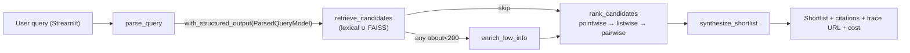

# LangGraph Recruiter Agent

A portfolio demo showing how to wrap an LLM in a small, explicit graph of
deterministic steps using [LangGraph](https://github.com/langchain-ai/langgraph).
Given a free-text role brief, the pipeline parses it into structured filters,
pulls candidates from a MySQL table of parsed LinkedIn profiles through a
hybrid (lexical ∪ embedding) retriever, ranks them with an LLM
(pointwise → listwise rerank → pairwise tie-break), and synthesizes a cited
shortlist for a hiring manager. The rubric self-improves: human labels feed
a calibration script that refits per-dimension weights and affine gains.


## Four use cases in one repo

This repo reads four different ways on purpose:

1. **Recruiter tooling.** A recruiter drops a natural-language role brief
   into the Streamlit UI and gets back a ranked, cited shortlist with an
   inline "this is why" breakdown per candidate. See the
   [Quickstart](#quickstart) and the Streamlit screenshot above.
2. **LLM-in-the-loop reference pipeline.** Every LLM call sits behind a
   deterministic fallback, so a missing `OPENAI_API_KEY`, a transient
   network error, or a schema-violating response never aborts the run —
   the graph returns a heuristic result and surfaces the reason in
   `error_messages`. See the per-node fallback table in
   [Architecture](#architecture).
3. **Calibrated rubric loop.** The 5-dimension rubric isn't hand-tuned:
   [`scripts/calibrate.py`](scripts/calibrate.py) ingests MySQL-stored
   human labels and solves for per-dimension **weights** (NNLS + simplex
   projection) and **affine gains** (OLS, per-dimension). The committed
   v2 fit cut overall MAE from 0.837 → **0.345** on the seed fixture;
   see the [Calibration loop](#calibration-loop) section for the full
   before/after table and the bias-vs-weight diagnostic.
4. **Hybrid retrieval + rerank pattern.** `retrieve_candidates` unions
   lexical SQL (with LLM-generated role paraphrases) and a FAISS
   in-process embedding index. `rank_candidates` then runs pointwise
   scoring → listwise top-K rerank → pairwise tie-break on near-ties.
   This is the pattern most production recommendation-style pipelines
   converge on; see [Hybrid retrieval](#hybrid-retrieval-round-2) and
   the architecture diagram.

## LangChain / LangGraph surface area

Every idiom this demo exercises, in one table, so a reviewer can scan the
repo in 90 seconds:

| Idiom | Where it lives | What it buys you here |
|-------|---------------|----------------------|
| `StateGraph` with a `TypedDict` state | [`src/langgraph_app.py`](src/langgraph_app.py) `build_graph()`, [`src/schemas.py`](src/schemas.py) `RecruiterGraphState` | Single source of truth for inter-node data; easy to inspect and test |
| `llm.with_structured_output(PydanticModel)` | `parse_query_node`, pointwise ranker, listwise reranker, pairwise tie-break | Validated JSON via OpenAI tool-calling; no hand-rolled `json.loads` + try/except |
| `StateGraph.add_conditional_edges(...)` | `should_enrich` → `enrich_low_info` \| `rank_candidates` | Canonical LangGraph routing; low-info candidates get an extra enrichment pass |
| Two-stage rank → pairwise tie-break | `_pointwise_rank_with_llm` + `_listwise_rerank_top_k` + `_pairwise_tiebreak_adjacent` | Reference pattern for LLM-scoring pipelines; pairwise adds visible quality lift on near-ties (`< 0.3` gap) with a strict call budget |
| Evidence-grounded guardrail | `_merge_llm_dimension_ranking` + `DimensionEvidenceModel.dimension_evidence` | Rejects LLM dimension swings > 3.0 that don't quote source text; caps hallucination-driven score jumps |
| Hybrid retrieval (lexical ∪ FAISS) | [`src/retriever.py`](src/retriever.py) `search_profiles`, [`src/embeddings_index.py`](src/embeddings_index.py) `semantic_search` | LLM-generated `role_paraphrases` union + in-process FAISS inner-product index over `headline + about_text`; cached to `.cache/embeddings.npz` |
| `@traceable` + LangSmith run URL in UI | All 5 nodes + `run_recruiter_search`; sidebar + top-of-page metrics in [`app.py`](app.py) | One trace tree per run with each node as a child; sidebar links straight to the trace |
| Token / cost counter via callback handler | `TokenUsageCollector(BaseCallbackHandler)` in [`src/langgraph_app.py`](src/langgraph_app.py) | Surfaces `{llm_calls, total_tokens, estimated_cost_usd}` in the UI without a LangSmith API round-trip |
| Deterministic fallbacks at every node | Every `*_node` in `src/langgraph_app.py` | Missing API key / validation error / DB miss → graph still returns a useful result with the reason surfaced |
| Human-in-the-loop calibration harness | [`src/labels_store.py`](src/labels_store.py), [`scripts/calibrate.py`](scripts/calibrate.py), [`config/weights.json`](config/weights.json) | Rubric weights + per-dim affine gains aren't hardcoded — they're fit from MySQL labels (NNLS + simplex, OLS) with MAE-before/after provenance and a bias-vs-weight diagnostic |

## Why this is interesting
- **LangGraph is the plumbing, not the magic.** Each node has a narrow job so
  the system is testable and easy to reason about.
- **LLM + SQL together.** Structured filters from the LLM are passed into
  parameterized SQL, so ranking only runs over rows that already pass
  hard constraints.
- **Graceful degradation.** Every node has a deterministic fallback: no
  `OPENAI_API_KEY`, no JSON output, no DB match — the graph still returns
  something meaningful and surfaces the reason in the UI.
- **Self-improving rubric.** Human labels flow back through
  `scripts/calibrate.py`, which fits weights and per-dimension gains
  against them and commits a versioned `config/weights.json`. Not a
  mechanism that "exists" — a mechanism with committed before/after
  numbers on a reproducible seed fixture.
- **Shippable demo surface.** Streamlit front end with parsed filters,
  ranked candidate cards, a shortlist summary that cites `profile_id`s,
  starter-prompt chips, a token/cost counter, and a one-click copy of
  the shortlisted profile IDs.

## Architecture



| Node | Responsibility | LLM? | Fallback |
|------|----------------|------|----------|
| `parse_query` | Extract `ParsedQueryModel` (role, skills, location, must-have, min experience, up to 3 `role_paraphrases`) from free-text brief | Yes (`with_structured_output`) | Heuristic keyword extractor; role brief treated as a single role keyword |
| `retrieve_candidates` | Hybrid recall: parameterized SQL (one primary query + one per `role_paraphrase`) unioned with FAISS embedding top-K over `headline + about_text` | No (LLM was already used to produce paraphrases upstream) | Auto-relax strict filters when zero rows return; lexical-only if FAISS / OpenAI unavailable |
| `enrich_low_info` *(conditional)* | For candidates with `about_text < 200` chars, synthesize `about_text_enriched` from `experience_json` + `education_json` | No | Route is skipped when every candidate already has enough `about_text` |
| `rank_candidates` | Stage-1: per-candidate 5-dimension rubric via `with_structured_output(DimensionRankingResponse)` + match reasons/risks/evidence. Stage-2: listwise rerank of top-5 via `with_structured_output(ListwiseRerankResponse)`. Stage-3: pairwise tie-break on adjacent candidates within 0.3 via `with_structured_output(PairwiseDecision)`, capped to 3 LLM calls per run | Yes | Deterministic per-dimension scorers + pointwise-only ordering; pairwise stage is optional and no-ops when there are no near-ties |
| `synthesize_shortlist` | Cited hiring-manager-ready summary of top candidates | Yes | Template list with `profile_id` citations |

Implemented in [`src/langgraph_app.py`](src/langgraph_app.py), with types in
[`src/schemas.py`](src/schemas.py) and DB access in
[`src/retriever.py`](src/retriever.py).

## Data

The demo reads from a MySQL table, `linkedin_api_profiles_parsed`, with the
following relevant columns:

- `profile_id` (unique)
- `name`, `headline`, `location`, `source_table`
- `about_text`, `about_char_count`
- `skills_json`, `skills_count`
- `experience_json`, `experience_count`
- `education_json`, `education_count`

The demo in this repo was built against a **1,000-row random sample** of
LinkedIn API profiles. You can point it at your own MySQL instance by
populating `.env` (see `.env.example`).

## Quickstart

Requires Python 3.9+ and access to the MySQL table above.

```bash
# 1. Clone + set up
git clone https://github.com/tafokints/langraph_ranker_sample.git
cd langraph_ranker_sample
pip install -r requirements.txt

# 2. Configure secrets
cp .env.example .env
# edit .env with your DB_* values and OPENAI_API_KEY

# 3. Verify DB connectivity
python test_db_connection.py

# 4. Run the Streamlit demo
streamlit run app.py
```

Then open <http://localhost:8501>, type a role brief on the left, and click
**Run recruiter agent**.

### CLI mode (no UI)

```bash
python main.py "Senior technical recruiter hiring ML engineers" --top-k 6
```

### Smoke test (no UI)

```bash
python scripts/smoke_test.py
```
Runs three representative prompts (role-focused, skill-focused,
location-focused) and prints a PASS/FAIL report.

## Configuration

| Env var | Required | Default | Description |
|---------|----------|---------|-------------|
| `DB_HOST`, `DB_USER`, `DB_PASSWORD`, `DB_NAME` | Yes | — | MySQL connection |
| `DB_PORT` | No | `3306` | MySQL port |
| `OPENAI_API_KEY` | Yes for LLM mode | — | Enables LLM parsing/ranking/synthesis |
| `OPENAI_MODEL` | No | `gpt-4o-mini` | Chat model used by all LLM nodes |
| `LANGSMITH_TRACING` | No | `false` | Set to `true` to enable LangSmith tracing (also honors the legacy `LANGCHAIN_TRACING_V2`) |
| `LANGSMITH_API_KEY` | Only when tracing | — | LangSmith personal API key (`ls__...`) |
| `LANGSMITH_PROJECT` | No | `default` | LangSmith project name the runs are posted to |

## Project layout

```
app.py                     Streamlit UI
main.py                    CLI entrypoint
test_db_connection.py      Minimal MySQL smoke test
requirements.txt
scripts/
  smoke_test.py            Headless end-to-end test across 3 prompts
src/
  __init__.py
  langgraph_app.py         LangGraph: 4 nodes + state + fallbacks
  retriever.py             Parameterized SQL with structured filters
  schemas.py               TypedDicts for graph state and parsed query
docs/
  streamlit_demo.png       Screenshot used in this README
.cursor/rules/
  karpathy-guidelines.mdc  Karpathy-inspired behavioral rules for agents
.streamlit/
  config.toml              Local theme + headless defaults
.env.example               Template for local env vars
```

## Ranking rubric (5-dimension scoring)

`rank_candidates` produces five sub-scores (0-10 each), grounded in structured
signals, then aggregates them into the overall `rank_score` using fixed weights
tuned for an SF-based startup founding/early-team lens:

| Dimension | Weight | Signals |
|-----------|--------|---------|
| Technical background | 0.30 | Technical titles and stack keywords (Python/PyTorch/AWS/...), skills count |
| Founder experience | 0.25 | Founder / co-founder / founding-engineer / CEO / CTO titles, YC / round / exited context |
| PhD / Researcher | 0.15 | PhD/doctorate, research roles (research scientist, postdoc, PI), publication venues (arXiv, NeurIPS, ...) |
| Education prestige | 0.15 | Top-tier or strong schools, highest degree bump |
| SF location fit | 0.15 | SF/Bay Area (10), CA tech (7), major US tech hub (5), US/remote (4), else (2), missing (1) |

A **deterministic feature extractor** always computes all 5 sub-scores from
`headline`, `about_text`, `experience_json`, `education_json`, and `location`.
When the LLM is enabled it receives those baselines in the prompt and is asked
to *refine* each sub-score (not start from zero), with a short evidence-grounded
reason per dimension. The final `rank_score` is always re-aggregated from the
merged sub-scores, so the overall number is consistent with its parts. If the
LLM call or JSON parse fails, the deterministic baseline is used unchanged.

Weights live in `DIMENSION_WEIGHTS` in [`src/langgraph_app.py`](src/langgraph_app.py),
resolved at import time by [`src/weights_loader.py`](src/weights_loader.py) which
reads [`config/weights.json`](config/weights.json) (and falls back to the
`DEFAULT_DIMENSION_WEIGHTS` constant if that file is missing or invalid).

## Calibration loop

The rubric self-improves by collecting per-candidate human labels and refitting
the five weights against them. There are two failure modes we calibrate against
separately:

- **Per-layer miscalibration** (a dimension's heuristic drifts from how a
  non-technical reviewer perceives it, e.g. we score "PhD" too generously).
- **Overall-score miscalibration** (individual dimensions are fine, but the
  weighted aggregate doesn't match perceived candidate fit).

### Label schema

Each label, written to the MySQL table `recruiter_rubric_labels` by
[`src/labels_store.py`](src/labels_store.py), is:

- 5 per-dimension scores (0-10, one per `DIMENSION_KEYS` entry)
- 1 overall score (0-10)
- optional short note
- labeler handle (`"me"` by default; multiple labelers are supported with no
  schema change)

Labels are captured inline from the Streamlit candidate card — expand
**Rate this candidate**, adjust sliders, click **Save rating**.

### Calibrator CLI

```bash
# Minimal report only; do not write weights.
python scripts/calibrate.py --dry-run

# Fit weights using all labels (requires >=15 by default).
python scripts/calibrate.py

# Fit only against your own labels.
python scripts/calibrate.py --labeler me --min-labels 20

# Add per-labeler MAE + inter-labeler disagreement matrix (dry-run recommended).
python scripts/calibrate.py --per-labeler --dry-run
```

For every run the CLI writes a markdown report to `reports/calibration_<timestamp>.md`
with:

1. Per-dimension **MAE**, signed **bias** (heuristic minus human), **Spearman**
   rank correlation, and heuristic/human std devs. Dimensions with
   `|bias| > 1.5` or `MAE > 2.0` are flagged as miscalibrated — fix the
   corresponding token list or base score in [`src/langgraph_app.py`](src/langgraph_app.py)
   and re-run the CLI to confirm the bias shrank.
2. Overall **MAE before** (current weights + gains) vs **MAE after** (fitted
   weights + gains), plus a "fit weights only, gains fixed at identity"
   ablation so you can see whether the gain fit bought you anything beyond
   what re-weighting alone would have.
3. **Bias-vs-weight diagnostic** — one row per dimension. Applies *only*
   the fitted bias for that dimension (gain=1, other dims untouched),
   refits weights on top, and reports the resulting MAE next to the
   weights-only baseline. A positive Δ is a tell: "this dimension has a
   real systematic offset; go fix the scorer (token list / proximity
   window) instead of hiding it behind a weight." Near-zero Δ means
   re-weighting already absorbs it and the scorer is fine as-is.
4. **Per-labeler section** (when `--per-labeler` is passed). One row per
   labeler with N, per-dim |heuristic − human|, and overall MAE against
   the fitted model. If multiple labelers have rated overlapping
   profiles, it also prints an NxN mean-|overall_A − overall_B|
   disagreement matrix. This is how you answer "do my two labelers
   actually mean the same thing by 'PhD researcher'?" before you
   average their labels.

Unless `--dry-run` is set and N >= `--min-labels`, a new `config/weights.json`
is written with version (`v1`, `v2`, ...), fit timestamp, and both MAEs. The
previous file is backed up to `config/weights.prev.json`.

### Seed labels + reproducible calibration run

The repo ships a reproducible calibration fixture so reviewers can run the
loop end-to-end without manually labeling anything:

```bash
python scripts/generate_seed_labels.py --write-db  # regenerate + insert (one-shot)
python scripts/load_seed_labels.py                 # OR: load the committed fixture
python scripts/calibrate.py --labeler seed-demo --min-labels 15
```

`scripts/generate_seed_labels.py` runs the three smoke prompts, takes the
top candidates from each, applies a deterministic perceptual adjustment that
simulates the most common human/heuristic disagreements (e.g. humans discount
"postdoc" as research, weight graduation signals harder, reward even mild
founder signals), and commits both:

- [`fixtures/seed_labels.sql`](fixtures/seed_labels.sql) — 21 INSERT rows,
  idempotent (DELETE-then-INSERT by (labeler, profile_id)).
- [`fixtures/seed_labels.json`](fixtures/seed_labels.json) — the same
  rows with heuristic scores kept alongside the adjusted labels for
  debugging.

On the committed fixture (21 labels, labeler `seed-demo`), running
`scripts/calibrate.py --labeler seed-demo --min-labels 15` produced:

| metric | before fit | after fit | Δ |
|---|---|---|---|
| Overall MAE (weights + gains) | 0.837 | **0.345** | **+0.492** |
| Weights-only ablation (gains fixed at identity) | — | 0.414 | +0.423 |

So gains contribute about `0.069` MAE on top of re-weighting alone on this
fixture, confirming the per-dimension affine transform is pulling its own
weight rather than piggybacking on the weight fit. The committed
[`config/weights.json`](config/weights.json) captures this run (version
`v2`, `n_labels=21`, `mae_before=0.8367`, `mae_after=0.3448`). Delete the
file to revert to the v1 defaults.

### Weight + gain fit

Each dimension is fit with a two-step linear model. First, per-dimension
affine transform:

\[
\text{adjusted}_i(x) = \mathrm{clip}\big(g_i \cdot x + b_i,\ 0,\ 10\big)
\quad\text{with}\quad g_i \in [0.25,\ 3],\ b_i \in [-5,\ 5]
\]

`g_i` and `b_i` are fit per dimension via ordinary least squares on the
(heuristic, human) pairs. They're clamped so a single outlier can't yank
a dimension off its sensible range. Second, given adjusted dim-scores
`x̃_k ∈ R^5` and human overall `y_k`:

\[
\min_{w \in \mathbb{R}^5} \sum_k (w \cdot \tilde{x}_k - y_k)^2
\quad\text{s.t.}\quad w_i \ge 0,\ \sum_i w_i = 1
\]

Implemented as `scipy.optimize.nnls` (non-negativity) followed by closed-form
Euclidean projection onto the probability simplex (Duchi et al. 2008) to
enforce `sum = 1`. Deleting `config/weights.json` reverts behavior to the
hardcoded defaults and identity gains.

## Hybrid retrieval (Round 2)

`retrieve_candidates` unions two recall paths before ranking:

1. **Lexical SQL** with weighted `LIKE` scoring. Run once per query; plus
   one additional query per LLM-generated `role_paraphrase` (see
   [`ParsedQueryModel.role_paraphrases`](src/schemas.py)) to surface
   candidates whose text uses a different phrasing of the role
   (e.g. "machine learning engineer" vs "ml engineer").
2. **Embedding recall** via an in-process FAISS inner-product index over
   `headline + about_text`, built with `text-embedding-3-small`. See
   [`src/embeddings_index.py`](src/embeddings_index.py).

The FAISS index is cached to `.cache/embeddings.npz` on first build. Delete
that file (or call `src.embeddings_index.build_index(force=True)`) to force
a rebuild when the underlying data changes or when you want to switch
embedding models.

Embedding recall is best-effort: if `faiss-cpu` isn't installed,
`OPENAI_API_KEY` is missing, or the cache can't be built, the pipeline
silently falls back to lexical-only recall and a note is added to the run's
`error_messages`.

## Design notes and tradeoffs

- **Prototype retrieval.** Lexical SQL (`LIKE` with weighted hits) is used
  instead of embeddings/vector search. This keeps the demo minimal and
  explicit; the UI labels it as prototype retrieval so reviewers
  understand the scope.
- **Small sample.** The demo was exercised against a 1,000-row random
  sample. When a strict filter returns zero rows, the graph relaxes
  must-have/location/min-experience constraints once and retries — this is
  surfaced as a "Run warnings" message.
- **Error isolation.** Each node captures its own exceptions into
  `error_messages` so a failure at any step degrades gracefully rather
  than aborting the run.
- **No hidden state.** All shared data flows through a single `TypedDict`
  (`RecruiterGraphState`) — easy to inspect and test.

## License

MIT
