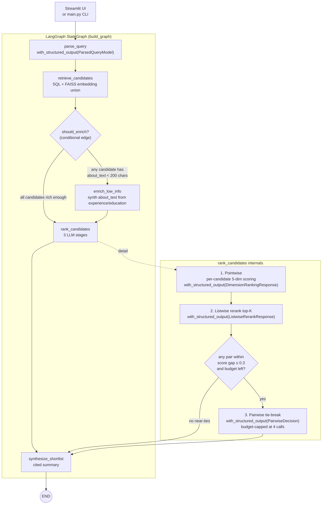

# Architecture

> **TL;DR.** A LangGraph `StateGraph` of 5 nodes. Deterministic retrieval and
> dimension scoring is the floor; bounded LLM calls (4 of them, all
> `with_structured_output`) refine and reorder. One conditional edge handles
> the only branching case (low-info results need an extra enrichment pass).
> Every node has a deterministic fallback so the pipeline still produces a
> ranked shortlist when the LLM is unavailable.

## The graph



## Node-by-node contract

| # | Node | Inputs (read from state) | Outputs (written to state) | LLM? | Deterministic fallback when LLM unavailable |
|---|---|---|---|---|---|
| 1 | `parse_query` | `question_text` | `parsed_query: ParsedQuery` | Yes — `with_structured_output(ParsedQueryModel)` | Heuristic keyword extractor; the raw question becomes a single role keyword |
| 2 | `retrieve_candidates` | `parsed_query` | `candidate_profiles: List[Dict]` | No (LLM-generated paraphrases were captured upstream by `parse_query`) | Lexical SQL only when FAISS or `OPENAI_API_KEY` is missing; auto-relax filters when zero rows return |
| 3 | `enrich_low_info` *(conditional)* | `candidate_profiles` | mutated `about_text_enriched` per candidate | No (string concat over `experience_json` + `education_json`) | Always available; conditional edge skips this node entirely when no low-info candidates |
| 4 | `rank_candidates` (3 sub-stages) | `candidate_profiles`, `parsed_query`, `weights_override`, `gains_override`, `feature_flags` | `ranked_candidates: List[RankedCandidate]` | Yes — 3 LLM calls (pointwise, listwise, pairwise tie-break), all structured-output | Deterministic 5-dim scorer + pointwise-only ordering; pairwise stage no-ops when no near-ties remain |
| 5 | `synthesize_shortlist` | `ranked_candidates`, `parsed_query` | `shortlist_summary: str`, `trace_url: str` | Yes — free-form chat | Templated bullet list with `profile_id` citations |

The state object is `RecruiterGraphState` — a `TypedDict` defined in
[`src/schemas.py`](../src/schemas.py). All inter-node data lives there, which
makes node signatures consistent (`def x_node(state) -> state`) and the
graph easy to test by injecting a state dict directly.

## The conditional edge

The whole reason this is a `StateGraph` and not a linear chain:

```python
graph_builder.add_conditional_edges(
    "retrieve_candidates",
    should_enrich,              # returns "enrich" or "skip"
    {
        "enrich": "enrich_low_info",
        "skip":   "rank_candidates",
    },
)
```

`should_enrich(state) -> str` looks at the retrieved candidates and routes
based on whether any of them have `about_text < 200` characters. Three
behaviors:

- **All candidates rich enough** → skip the enrichment node, save an
  `experience_json` traversal per candidate.
- **At least one thin profile** → run `enrich_low_info` to synthesize an
  `about_text_enriched` from structured fields before ranking.
- **Feature-flagged off** (R4-4 ablation harness) → skip regardless. This
  is how the ablation table isolates the conditional edge's contribution.

## The three-stage ranker

`rank_candidates` is the most LLM-heavy node. Three stages, each more
expensive and more focused than the last:

### Stage 1 — Pointwise (always runs)

Per candidate: `with_structured_output(DimensionRankingResponse)` returns
5 sub-scores (0-10) with one-sentence reasons and quoted evidence.

The LLM does **not** start from zero. The deterministic baseline scorer
(`_compute_dimension_scores`) runs first and the heuristic numbers are
included in the prompt. The LLM is asked to *refine* — and
`_merge_llm_dimension_ranking` enforces an evidence guardrail: any
LLM swing > 3.0 from the baseline that doesn't quote source text is
rejected. The deterministic baseline is the floor.

### Stage 2 — Listwise rerank top-K (always runs)

One `with_structured_output(ListwiseRerankResponse)` call sees all
top-K candidates simultaneously and emits a re-ordered list with
brief justifications. This catches cases where pointwise scoring
got per-candidate signals right but the relative ordering wrong.

### Stage 3 — Pairwise tie-break (conditional)

Only fires when adjacent (or within-window-2 after R4-3) candidates
have aggregate scores within `0.3` of each other.
`with_structured_output(PairwiseDecision)` takes two candidates and
returns a winner with a one-sentence reason. Budget-capped at 4
LLM calls per search to keep cost predictable.

Disabled by `feature_flags.disable_pairwise_tiebreak` for ablation.

## LangChain surface area

Every LangChain idiom this project exercises, in one table:

| Idiom | Where it lives | What it buys you |
|---|---|---|
| `langchain_openai.ChatOpenAI` | `_build_llm()` in [`src/langgraph_app.py`](../src/langgraph_app.py) | Single chat client, configurable via `OPENAI_MODEL`, `temperature=0` |
| `llm.with_structured_output(PydanticModel)` × 4 | `parse_query`, pointwise rank, listwise rerank, pairwise tie-break | Validated JSON via OpenAI tool-calling — no hand-rolled `json.loads` + try/except in the graph |
| `langchain_core.callbacks.BaseCallbackHandler` | `TokenUsageCollector` in [`src/langgraph_app.py`](../src/langgraph_app.py) | Per-search token + USD cost estimate surfaced in the Streamlit UI without a LangSmith API round-trip |
| `RunnableConfig`-style callbacks | `_llm_invoke_config()` passed to every `.invoke(...)` | Attaches the token collector to each LLM call |
| `langchain_openai.OpenAIEmbeddings` | [`src/embeddings_index.py`](../src/embeddings_index.py) | `text-embedding-3-small` over `headline + about_text`, cached to `.cache/embeddings.npz` |
| `@traceable` (LangSmith) | All 5 nodes + `run_recruiter_search` top-level | One nested trace per search; trace URL surfaced in the UI |

## State shape

`RecruiterGraphState` is a `TypedDict(total=False)` so each node only has
to populate the fields it owns. Key fields:

| Field | Owner node | Purpose |
|---|---|---|
| `question_text`, `top_k`, `min_experience_entries` | (caller) | Search parameters |
| `parsed_query: ParsedQuery` | `parse_query` | Structured filters used by retrieval |
| `candidate_profiles: List[Dict]` | `retrieve_candidates`, `enrich_low_info` | Raw profile rows from MySQL + FAISS |
| `ranked_candidates: List[RankedCandidate]` | `rank_candidates` | Final ordered list with per-dim scores, reasons, evidence |
| `shortlist_summary: str` | `synthesize_shortlist` | Cited natural-language summary |
| `trace_url: str` | top-level `run_recruiter_search` | LangSmith trace URL for the run |
| `error_messages: List[str]` | every node | Per-node error capture (graph never aborts) |
| `weights_override`, `gains_override` | (caller, optional) | A/B testing alternative calibrations at runtime |
| `feature_flags: Dict[str, bool]` | (caller, optional) | Disables specific stages for the R4-4 ablation harness |

## Calibration loop (out-of-band)

The graph itself is online. Calibration is offline — a separate workflow
that fits the deterministic scorer's output to human labels:

```mermaid
flowchart LR
    streamlit["Streamlit UI<br/>(app.py + pages/2_Label_queue.py)"] -->|save_label| mysql[("MySQL<br/>recruiter_rubric_labels")]
    mysql -->|load_labels| calibrate["scripts/calibrate.py"]
    calibrate -->|"NNLS + simplex projection<br/>(per-dim gain/bias + aggregate weights)"| weights["config/weights.json"]
    calibrate -->|"snapshot with git SHA"| history["config/weights.history/&lt;date&gt;_&lt;sha&gt;.json"]
    calibrate -->|"markdown report"| report["reports/calibration_&lt;ts&gt;.md"]
    weights -->|read at import| graph["Graph at next search"]
```

The calibrator never touches the LLM. It only fits per-dimension
`gain` and `bias` plus aggregate `weights` against the deterministic
scorer's output. That's the whole point of bounding the LLM's
influence: the optimization target is stable.

See [`scripts/calibrate.py`](../scripts/calibrate.py) and the
"Calibration loop" section of the main [README](../README.md).

## Ablation harness

[`scripts/ablation_table.py`](../scripts/ablation_table.py) drives the
graph with different `feature_flags` settings to measure each stage's
contribution to top-K stability:

```mermaid
flowchart LR
    prompts["fixtures/smoke_prompts.yml<br/>(10 held-out prompts)"] --> harness[scripts/ablation_table.py]
    harness -->|"5 configs × 10 prompts<br/>via feature_flags"| graph["build_graph()"]
    graph -->|top-3 per config| jaccard["Jaccard@3 vs<br/>full pipeline (reference)"]
    jaccard --> table["5-row markdown table<br/>(README + reports/ablation_run.log)"]
```

This is how we answer "which LLM stage actually moves the ranking?"
The harness uses the same `feature_flags` field already on
`RecruiterGraphState` — no graph rewiring required.

## Where to look in the code

| You want to read about | Open this file |
|---|---|
| Graph wiring (`add_node`, `add_edge`, `add_conditional_edges`, `compile`) | [`src/langgraph_app.py`](../src/langgraph_app.py), `build_graph()` ~L1591 |
| All 4 `with_structured_output` calls | [`src/langgraph_app.py`](../src/langgraph_app.py), search for `with_structured_output` |
| Token / cost callback handler | [`src/langgraph_app.py`](../src/langgraph_app.py), `TokenUsageCollector` ~L107 |
| Pydantic schemas the LLM is bound to | [`src/schemas.py`](../src/schemas.py) — `ParsedQueryModel`, `DimensionRankingResponse`, `ListwiseRerankResponse`, `PairwiseDecision` |
| State shape | [`src/schemas.py`](../src/schemas.py), `RecruiterGraphState` |
| Hybrid retrieval (lexical SQL + FAISS) | [`src/retriever.py`](../src/retriever.py), [`src/embeddings_index.py`](../src/embeddings_index.py) |
| Deterministic dimension scorers | [`src/langgraph_app.py`](../src/langgraph_app.py), `_compute_dimension_scores` and the per-dim `_score_*` functions |
| Calibration math | [`scripts/calibrate.py`](../scripts/calibrate.py) |
| Ablation harness | [`scripts/ablation_table.py`](../scripts/ablation_table.py) |
